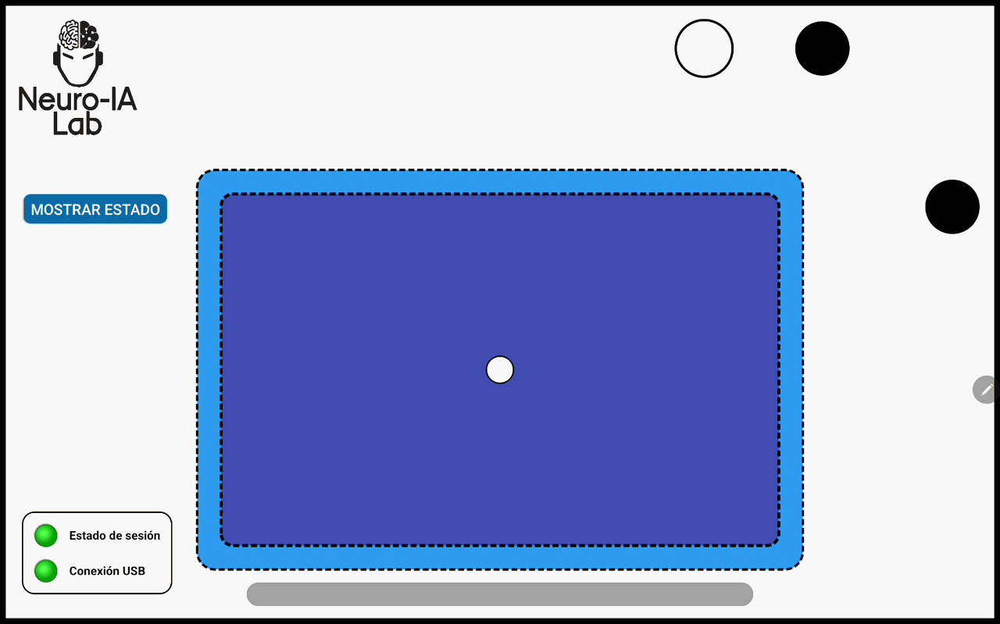
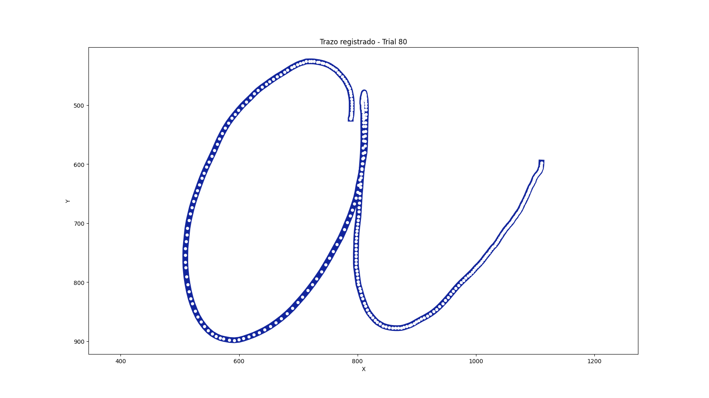
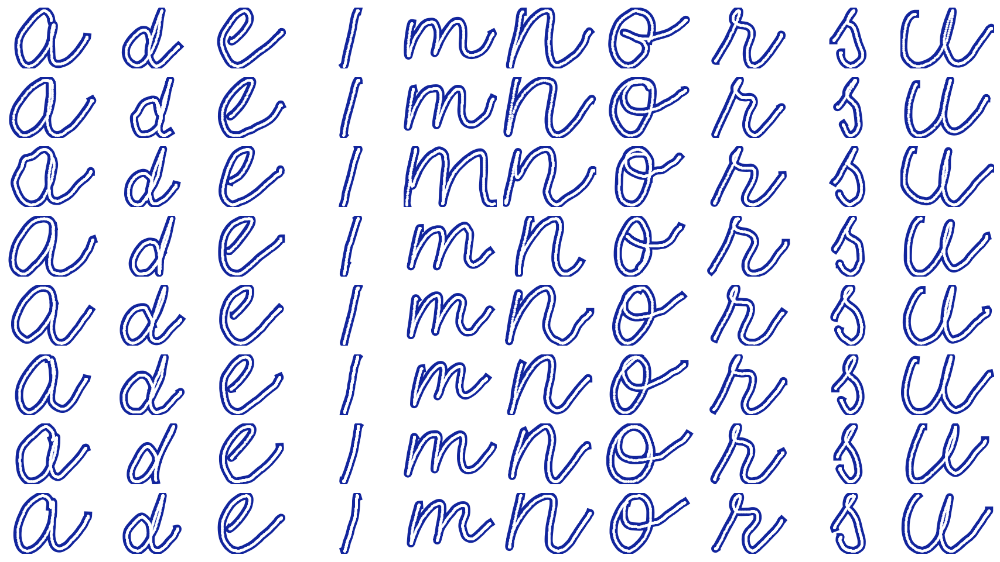

# ✍️ Handwriting Project (Python) ✍️

Proyecto para estudiar la factibilidad de decodificación del trazo continuo de letras del alfabeto español a partir del electroencefalograma.

Este repositorio contiene los script en Python para generar, gestionar y almacenar eventos. Enviar mensajes hacia la tablet donde se presentan los estímulos, recibir mensajes de la tablet, entre otras tareas.

Un resumen de la aplicación de la tablet que registra los trazos de las letras dibujadas puede encontrarse en [Handwriting Project - Android app](https://github.com/neuroialaborg/handwritingrecording)

## Autor MSc. BALDEZZARI LUCAS

💻 Github: [lucasbaldezzari](https://github.com/lucasbaldezzari)

📄 CVUY: [CV Lucas Baldezzari](https://exportcvuy.anii.org.uy/cv/?ce2da83661958a08b41a1469b83e1d91)

🟦 Linkedin: [Lucas Baldezzari](https://www.linkedin.com/in/lucasbaldezzari)

## Versión 2.0.0

Se implementa:

✅ SessionManager para control de rondas de entrenamiento de escritura ejecutada e imaginada.

✅ PreExperimentManager para control de rondas de preexperimento, tales como basal, emg y eog.

✅ SessionInfo para centralizar la información de la sesión, sujeto, tarea, ronda, run, cantidad de trials, nombre BIDS del archivo y demás metadatos necesarios para la ejecución.

✅ TabletMessenger para gestionar la comunicación entre la PC/Laptop y la tablet mediante *adb*, permitiendo:
  - enviar mensajes con la información de la sesión y del trial,
  - solicitar información a la tablet,
  - leer o descargar los archivos `.json` generados por cada trial.

✅ MarkerManager para creación y envío de marcadores LSL, tanto para la laptop como para la tablet, de forma de dejar registrados los eventos relevantes de cada fase del experimento.

✅ DataManagers para carga, lectura y organización de datos adquiridos durante el experimento:
  - `GHiampDataManager` para lectura de archivos `.hdf5` generados por g.HIAMP,
  - `LSLDataManager` para lectura de archivos `.xdf`, recuperación de streams, reconstrucción de trials, acceso a coordenadas, letras, timestamps, delays de pendown y demás información útil para análisis posteriores.
✅ Entornos gráficos para configuración y ejecución del experimento:
  - `InitAPP` para inicialización general del flujo de trabajo,
  - `RunConfigurationApp` para configuración de parámetros de sesión, tarea, duración de fases, letras, cantidad de runs y trials,
  - `LauncherApp` para monitoreo y control de la sesión en tiempo real.

✅Componentes gráficos auxiliares, como `SquareWidget`, para mostrar indicadores visuales, mensajes y estados durante la ejecución.

✅ Integración con `StimuliWindow` para presentación local de estímulos en rondas de preexperimento.

✅ Generación y organización de sesiones bajo una lógica consistente con nombres tipo BIDS, facilitando el almacenamiento posterior de los archivos generados.

✅ Soporte para rondas con duraciones fijas o aleatorias en fases como cue y rest, según la configuración seleccionada.

✅ Gestión completa del flujo experimental: inicio de sesión, inicio y fin de run, avance de trial, cambios de fase, registro temporal de eventos y cierre de sesión.

✅ Recuperación de coordenadas de escritura, eventos `penDown` y `penUp`, tiempos de inicio y fin de cada fase, y sincronización de esta información con los marcadores enviados durante la sesión.

✅ Base funcional para análisis offline de señales, comportamiento y trazos registrados durante el experimento.

### 🚀 Iniciar una ronda

Para ejecutar una ronda se puede hacer desde consola:

> python -m pyhwr.widgets.InitAPP

NOTA: Se recomienda crear un environment en conda, activar el ambiente, instalar las dependencias y ejecutar luego el comando mencionado arriba.

## Cominucación USB

En este proyeco, para poder conectar la PC o Laptop a la tablet es necesario contar con *Android Debug Bridge (adb)*.

Para instalar *adb* se debe ingresar a la página oficial de Android Developers y descargar la versión adecuada desde [acá](https://developer.android.com/tools/releases/platform-tools). Una vez descargado, descomprimir y agregar la carpeta a las Variables de Entorno de Windows, de esta manera, se podrá ejecutar *adb* desde consola.

NOTA: Podes encontrar la versión utilizada en este proyecto dentro de la carpeta [adb](https://github.com/lucasbaldezzari/pyhwr/tree/main/adb) de este repositorio.

## Demostración aplicación tablet

El gif de abajo muestra la aplicación de la tablet en funcionamiento (más info [acá](https://github.com/neuroialaborg/handwritingrecording)). Los trazos son dibujados por una persona voluntaria y la tablet registra toda la información necesaria para el posterior análisis.

  

### Trazos registrados

Debajo pueden verse los trazos registrados para una de las rondas de experimento sobre una persona voluntaria.

Una sóla letra:

  

Todas las letras para una ronda ejecutada.

  

# ❗️IMPORTANTE❗️

El repositorio completo se encuentra en [https://github.com/lucasbaldezzari/pyhwr](https://github.com/lucasbaldezzari/pyhwr). Próximamente será movido a la organización.